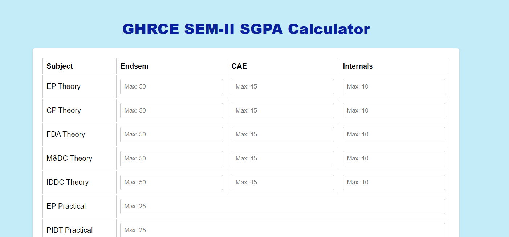

<h1 align="center">GHRCE SGPA Calculator</h1>

  <b>A Simple and Convenient Tool to Calculate SGPA</b>
   
   
  <a href="https://nobodie0raj.github.io/ghrcecgpacalculator.io/">View Demo</a>
  ·
  <a href="#usage">Usage</a>
  ·
  <a href="#contributing">Contributing</a>
  

<!-- Project Description -->
## Description

The GHRCE SGPA Calculator is a user-friendly web-based tool that allows GHRCE students to effortlessly calculate their Semester Grade Point Average (SGPA). This calculator takes into account subject scores obtained in theory exams, continuous assessment exams (CAE), internals, and practical exams. Currently Available for - Artificial Intelligence, Computer Science & Engineering, Information &
Technology, Data Science, Computer Science (Internet of Things), Computer Science (Artificial Intelligence & Machine Learning) & Computer Science (Cyber Security), Computer Science (Artificial Intelligence)

<!-- Project Screenshot -->

  

## Features

✨ Simple and intuitive interface for entering subject scores\
✨ Automatic calculation of SGPA based on entered scores\
✨ Supports multiple semesters \
✨ Real-time display of the calculated SGPA

## Usage

1. Choose the semester by choosing the respective button.
2. Enter the subject scores for the selected semester.
3. Click the "Calculate SGPA" button to calculate the SGPA.
4. The calculated SGPA will be displayed on the screen.

## Deployment

The GHRCE SGPA Calculator is deployed using GitHub Pages. You can access the live demo by clicking [here](https://nobodie0raj.github.io/ghrce-sgpa-calculator).

<!-- Development Setup -->
## Development

The project is developed using HTML, CSS, and JavaScript.
by Rajnand Bhardwaj & Payal Agrawal 
To set up the project locally, follow these steps:

1. Clone the repository: `git clone https://github.com/nobodie0raj/ghrcecgpacalculator.io`
2. Open the project in your preferred code editor.
3. Customize the calculator according to your requirements.
4. Open `index.html` in a web browser to view the calculator.

## Contributing

Contributions to the GHRCE SGPA Calculator are welcome! If you find any issues or have suggestions for improvement, please feel free to submit a pull request or open an issue in the project repository.

<!-- Disclaimer -->
## Disclaimer

Please note that this SGPA calculator is not an official tool for calculating SGPA. Results may vary, and it's always recommended to consult with your institution for official SGPA calculations.
